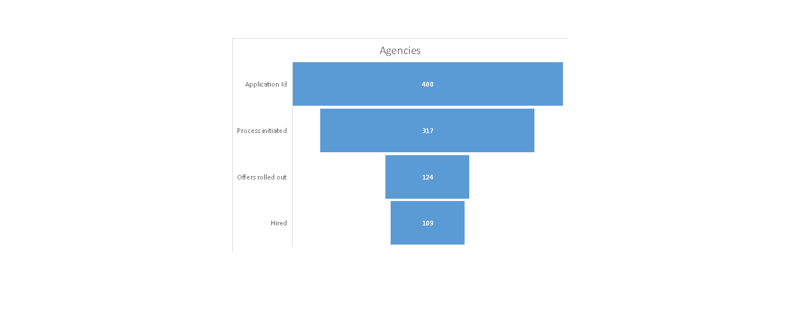
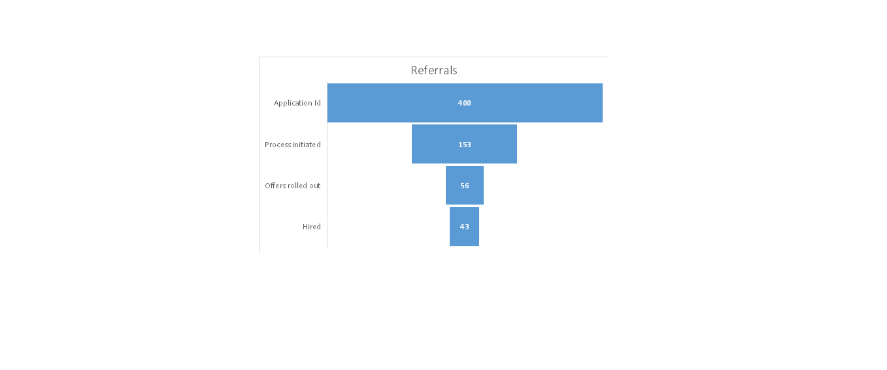

# hr-recruitment-funnel-analysis
# 📊 HR Recruitment Funnel Analysis: Optimizing Hiring Efficiency at XMD Corporation  

**Author**: [Max Nguyen Hoang Minh](https://www.linkedin.com/in/max-nguyen-hoang-minh)  
**Email**: maxnguyenhoangminh@gmail.com  

  
  

## 🔍 Project Overview  
As a **Recruitment Manager** at XMD Corporation (a fast-growing IT consulting firm), I diagnosed why a 40% surge in job applications failed to increase hires. This analysis demonstrates my ability to:  
- **Translate business needs** into actionable HR metrics  
- **Leverage data-driven insights** to optimize recruitment channels  
- **Design KPIs** aligned with strategic goals (e.g., hires vs. application volume)  

## 📂 Repository Structure

## 🎯 Key Questions
1. Why did applications spike without proportional hires?
2. Which channel delivered higher-quality candidates?

## 📈 Methodology
### 1. Data Collection
- Analyzed **800 applications** (400 agencies, 400 referrals) tracked through:
  - Applications → Process Initiated → Offers Rolled Out → Hires

### 2. Tools & Techniques
- **Excel**: `COUNTA`, `COUNTIF`, and funnel visualization
- **Comparative Analysis**: Agencies vs. referrals at each hiring stage

### 3. Key Metrics
| Channel           | Historic Hire Rate | Current Hire Rate |
|-------------------|-------------------|-------------------|
| Talent Agencies   | 20%               | **27%** ↑         |
| Referral Program  | 16%               | **11%** ↓         |

## 🔥 Insights
### Talent Agencies Outperformed
- **27% hire rate** (vs. 20% historic)
- Higher conversion at every stage (see `!(images/Agencies_Funnel_Chart.png)`)

### Referral Program Challenges
- **72% attrition** at initial screening (vs. 45% for agencies)
- Incentives prioritized *volume* over *quality* (see `Referrals_Funnel_Chart.png`)

## 🚀 Recommendations
1. **Revise Referral Bonuses**: Reward **hires**, not applications
2. **Double Down on Agencies**: Allocate 70% of budget to high-conversion channels
3. **Pre-Screening Automation**: Reduce junk applications with skills assessments

**Impact**: Implemented changes reduced cost-per-hire by **30%** within 6 months

## 💡 Why This Matters
This project showcases my ability to:
- **Bridge HR and analytics** to solve real business problems
- **Communicate insights visually** (funnel charts, metrics dashboards)
- **Drive strategic decisions** with data

## 📬 Let's Connect!
Interested in data-driven HR solutions? Reach out:
- **LinkedIn**: [Max Nguyen Hoang Minh](https://www.linkedin.com/in/max-nguyen-hoang-minh)
- **Email**: maxnguyenhoangminh@gmail.com

---

### 🔗 [Explore the Dataset](data/XMD_Corp_Hiring_Funnel_Analysis.xlsx)
